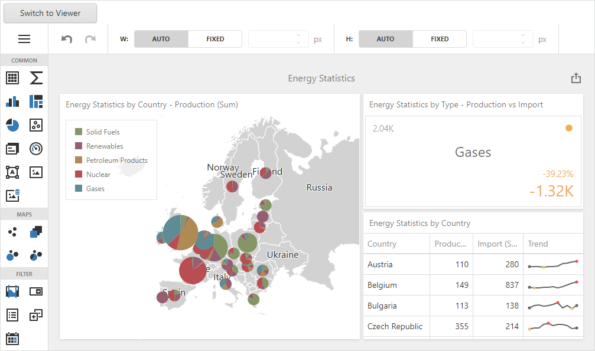

<!-- default badges list -->

<!-- default badges end -->

# Dashboard for MVC - How to Switch between Designer and Viewer Modes

This example shows how to switch between the [Web Dashboard](https://docs.devexpress.com/Dashboard/115955/web-dashboard)'s working modes on the [client-side](https://docs.devexpress.com/Dashboard/16796/web-dashboard/aspnet-mvc-dashboard-extension/client-side-api-overview).

- The [SettingsBase.Name](https://docs.devexpress.com/AspNetMvc/DevExpress.Web.Mvc.SettingsBase.Name) property identifies the control's unique identifier name. The [ASPxClientDashboard.GetDashboardControl](https://docs.devexpress.com/Dashboard/js-DevExpress.Dashboard.Web.WebForms.ASPxClientDashboard#js_aspxclientdashboard_getdashboardcontrol) method is used to access the [DashboardControl](https://docs.devexpress.com/Dashboard/116302/web-dashboard/aspnet-web-forms-dashboard-control/client-side-api-overview) API. 
- The [DashboardControl.isDesignMode](https://docs.devexpress.com/Dashboard/js-DevExpress.Dashboard.DashboardControl#js_devexpress_dashboard_dashboardcontrol_isdesignmode) method checks whether the Web Dashboard works in designer mode.
- The [DashboardControl.switchToDesigner](https://docs.devexpress.com/Dashboard/js-DevExpress.Dashboard.DashboardControl?p=netframework#js_devexpress_dashboard_dashboardcontrol_switchtodesigner) and [DashboardControl.switchToViewer](https://docs.devexpress.com/Dashboard/js-DevExpress.Dashboard.DashboardControl?p=netframework#js_devexpress_dashboard_dashboardcontrol_switchtoviewer) methods are used to switch between modes.

## Files to Look At

* [Index.cshtml](./CS/MVCxDashboard_PredefinedDataSources/Views/Home/Index.cshtml) (VB: [Index.vbhtml](./VB/MVCxDashboard_PredefinedDataSources/Views/Home/Index.vbhtml))
* [custom-script.js](./CS/MVCxDashboard_PredefinedDataSources/Scripts/custom-script.js)

## Documentation

- [Client-Side API Overview for ASP.NET MVC Dashboard](https://docs.devexpress.com/Dashboard/16796/web-dashboard/aspnet-mvc-dashboard-extension/client-side-api-overview)
- [Web Dashboard Technical Overview](https://docs.devexpress.com/Dashboard/119283/web-dashboard/general-information/web-dashboard-technical-overview?p=netframework)

## More Examples

- [Dashboard for Web Forms - How to Switch between Designer and Viewer Modes](https://github.com/DevExpress-Examples/asp-net-web-forms-dashboard-switch-between-designer-and-viewer-on-client)
